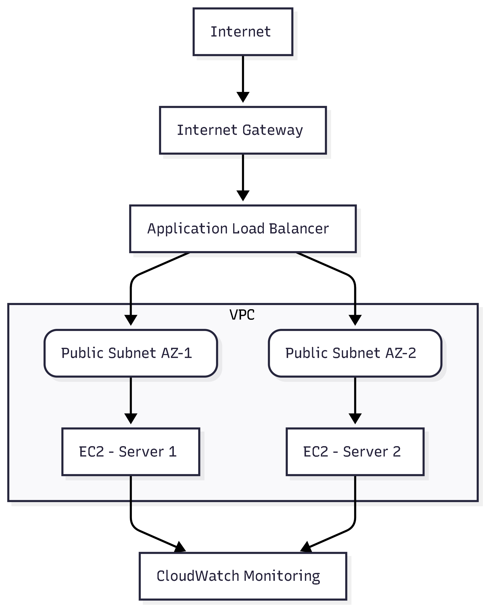

# aws-apache-infrastructure-deployment
Highly available Apache web server deployment on AWS using VPC, EC2, ALB, and CloudWatch

# 🚀 AWS Infrastructure Deployment & Monitoring

## 📌 Project Overview

This project demonstrates the deployment of a highly available Apache web server infrastructure on AWS.

The architecture includes:

* Custom VPC
* Public Subnets in multiple Availability Zones
* EC2 Instances running Apache
* Application Load Balancer (ALB)
* Security Groups
* CloudWatch Monitoring

---

## 🏗️ Architecture Diagram


---

## ⚙️ Services Used

* Amazon VPC
* Amazon EC2
* Application Load Balancer (ALB)
* IAM
* Amazon CloudWatch
* Security Groups

---

## 🔧 Deployment Steps

### 1️⃣ Created Custom VPC

* CIDR Block: 10.0.0.0/16
* Created two public subnets across different AZs
* Attached Internet Gateway
* Configured Route Tables

### 2️⃣ Launched EC2 Instances

* Amazon Linux 2023
* t2.micro
* Installed Apache Web Server

```bash
sudo yum update -y
sudo yum install httpd -y
sudo systemctl start httpd
sudo systemctl enable httpd
```

### 3️⃣ Configured Application Load Balancer

* Internet-facing ALB
* Registered both EC2 instances
* Enabled health checks

### 4️⃣ Monitoring with CloudWatch

* Monitored CPU Utilization
* Observed traffic distribution across instances

---

## 🌐 Output

The Load Balancer distributes traffic between:

* Server 1
* Server 2

Ensuring high availability and fault tolerance.

---

## 📊 Key Learnings

* Designing highly available cloud architecture
* Network isolation using VPC
* Load balancing and health checks
* Real-time monitoring using CloudWatch

---

## 📷 Screenshots

Screenshots are available in the `/Screenshots` folder.

---

## 🧠 Resume Impact Statement

Designed and deployed a highly available Apache web application infrastructure on AWS using custom VPC, multi-AZ EC2 instances, Application Load Balancer, IAM roles, and CloudWatch monitoring.

---

## 👨‍💻 Author

Rohit Sharma
